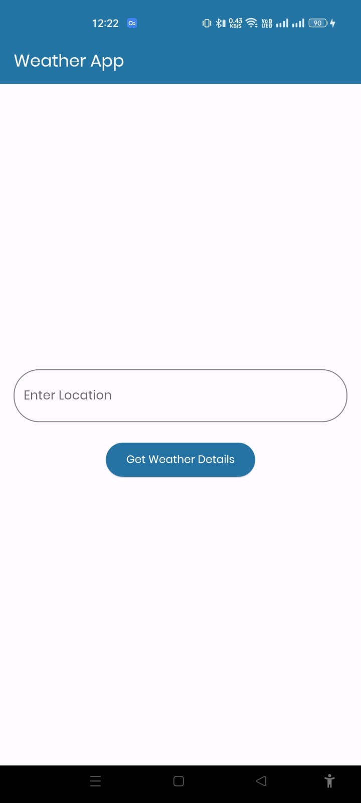
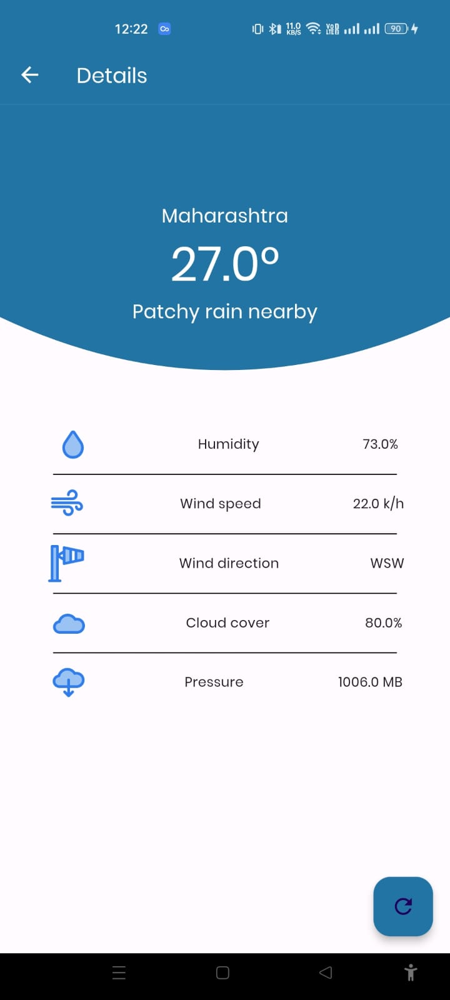

# Weather App

## Overview

A simple weather app built with Flutter that fetches and displays current weather information for a given city using the Weatherstack API. The app consists of a home screen to search for a city's weather and a weather details screen to display the weather data.

## Images


## Features

- **Search Functionality**: Search for weather in any city.
- **Weather Details**: Displays current temperature, weather condition, humidity, wind speed, wind direction, and cloud cover.
- **Error Handling**: Shows error messages if the API call fails or if the city name is invalid.
- **Data Persistence**: Saves the last searched city.
- **Responsive Design**: Works on mobile and tablet devices.
- **Refresh Functionality**: Refresh weather data on the details screen.

## Requirements

- Flutter SDK

## Setup

1. **Clone the repository**

    ```sh
    git clone https://github.com/Aihrarshaikh/Weather
    cd Weather
    ```

2. **Install dependencies**

    ```sh
    flutter pub get
    ```

3. **Run the app**

    ```sh
    flutter run
    ```

## Usage

1. **Home Screen**:
    - Enter the city name in the search bar.
    - Click on the "Get Weather" button to fetch weather data for the entered city.
    - If the text field is empty, a pop-up will alert the user.

2. **Weather Details Screen**:
    - Displays the weather details for the searched city.
    - Use the floating action button to refresh the weather data.

## Error Handling

- **Invalid City Name**: Displays a user-friendly error message.
- **API Call Failures**: Shows an appropriate error message.

## Dependencies

- `http`: For making HTTP requests.
- `provider`: For state management.

## License

This project is licensed under the MIT License.